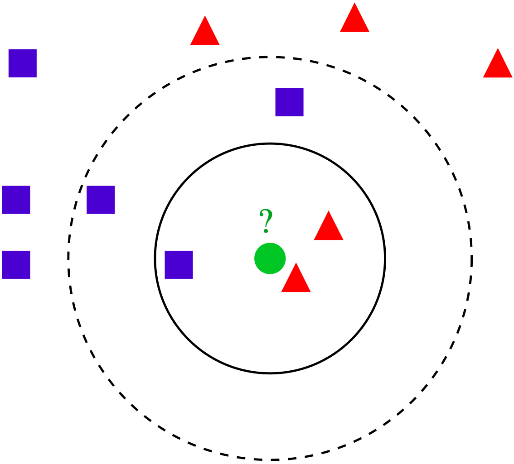
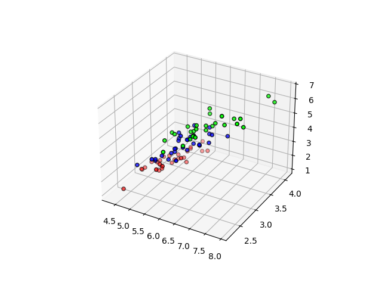

## K-vizinhos mais próximos

O algoritmo k-vizinhos mais próximos (k-NN) é um dos métodos de classificação mais comuns. Nele, a classificação de um elemento é determinada pelos k vizinhos mais próximos, ou seja, os k elementos cuja distância em relação ao ponto em questão seja menor. O elemento é classificado conforme a classe mais frequente entre esses vizinhos.

  

A escolha adequada de k é crucial para evitar o overfitting, onde o modelo se adapta excessivamente aos ruídos dos dados, ou o underfitting, quando o modelo não é suficientemente preciso. Técnicas heurísticas de otimização de hiperparâmetros ajudam a determinar o melhor valor para k.

Além da distância euclidiana, que foi utilizada neste código, existem outras métricas de distância, como a distância de Manhattan, que usa o módulo da diferença, e a distância de Mahalanobis. Outra variação comum é a utilização de uma medida de raio, que captura os vizinhos mais próximos sem precisar selecionar cada um individualmente.

No caso do meu código, não foi necessário realizar a normalização dos dados, pois todas as grandezas estavam em unidades semelhantes (centímetros). Além disso, adaptei o modelo para trabalhar com 4 coordenadas, correspondentes às 4 colunas do dataset Iris disponível no [Kaggle](https://www.kaggle.com/datasets/uciml/iris). Para 4 dimensões, a distância euclidiana ainda é válida, já que não sofre com a maldição da dimensionalidade — um fenômeno em que, em altas dimensões, os pontos tendem a se tornar quase equidistantes, tornando a medida de distância menos útil.

O algoritmo funciona recebendo como entrada as coordenadas de treinamento para que seja possível encontrar pela distância, os mais próximos. Esses exemplos possuem a classe ou valor da propriedade conhecido. Não há uma etapa de treinamento explícita, pois o modelo simplesmente calcula as distâncias entre o ponto a ser classificado e os pontos do conjunto de treinamento.

No meu código, eu criei uma classe chamada KNN onde estão os métodos de predição necessários para implementar o algoritmo, e no outro arquivo eu implemento a manipulação do .csv para extrair os dados do dataset, além de criar uma imagem que permite visualizar a separação feita pelo algoritmo e também o cálculo da acurácia. A cada execução (train.py), o dataset é embaralhado e dividido em 60% para treinamento e 40% para teste. O próximo passo para aprimorar a avaliação das métricas será implementar validação cruzada. Isso permitirá realizar múltiplos testes com subgrupos (folds), proporcionando uma média mais robusta dos resultados e melhorando a precisão da avaliação do modelo.

Uma visualização possível para a classificação que o algoritmo faz para o dataset pode ser vista na figura abaixo:

  
  

  Figura 1 - Pontos agrupados por cor, representando as flores Iris virginica, Iris versicolor e Iris setosa
  

A medida da acurácia é feita dividindo o número de previsões corretas pelo número total de previsões. Ela variou entre 94% e 96%, usando apenas um algoritmo simples k-NN, sem apelar para otimizações, como aplicar regressão, etc.

Follow me:
  
  
  
  
  
  

